# 🏗️ Architecture — Visual Textbook

A complete, GitHub-rendered visual guide to **stden/pythorust_tg**, a Rust-first
Telegram automation toolkit. Every diagram is grounded in real modules
(`src/…`), binaries (`src/bin/…`), and the MySQL schema — not idealized.

> **How to read this doc.** It climbs from the outside in: system context →
> containers → core components → then runtime flows (sequences, pipelines,
> decision trees) → data model → layering. Skim the diagrams top-to-bottom for a
> mental model; dive into a section when you touch that subsystem.

**Legend (shared across diagrams)**

| Shape / style | Meaning |
|---|---|
| `[(cylinder)]` | datastore (MySQL · Qdrant · Neo4j · SQLite) |
| rectangle | Rust module / binary / process |
| rhombus `{ }` | decision point |
| dotted edge | optional / "exposes" / cross-cutting |
| subgraph box | a bounded layer, phase, or process group |

---

## 1. 🌐 C4 — System Context

*Purpose:* the 10,000-ft view — who uses the toolkit and which external systems
it depends on. *Placement:* `docs/architecture.md` (top) or `README.md`.

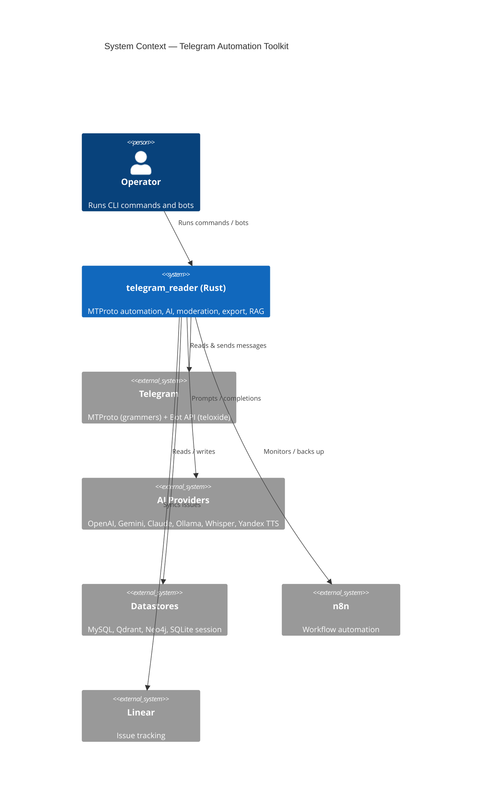

---

## 2. 📦 C4 — Container Diagram

*Purpose:* the deployable/runnable pieces inside the toolkit and how they split
responsibility. *Placement:* `docs/architecture.md`.

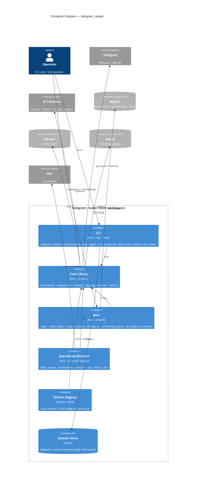

---

## 3. 🧩 Component — Core Library

*Purpose:* how `src/lib.rs` decomposes; `commands/` orchestrates, everything
else is a capability it calls. *Placement:* `docs/architecture.md`.

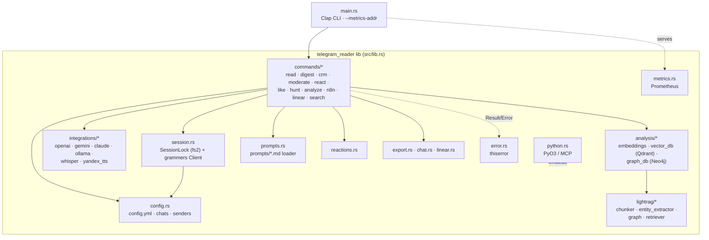

---

## 4. 🔐 Sequence — Session Initialization & Locking

*Purpose:* the **exclusive single-session** invariant — only one process may use
the Telegram session at a time, enforced by a file lock. *Placement:*
`docs/session-and-locking.md` or this doc.

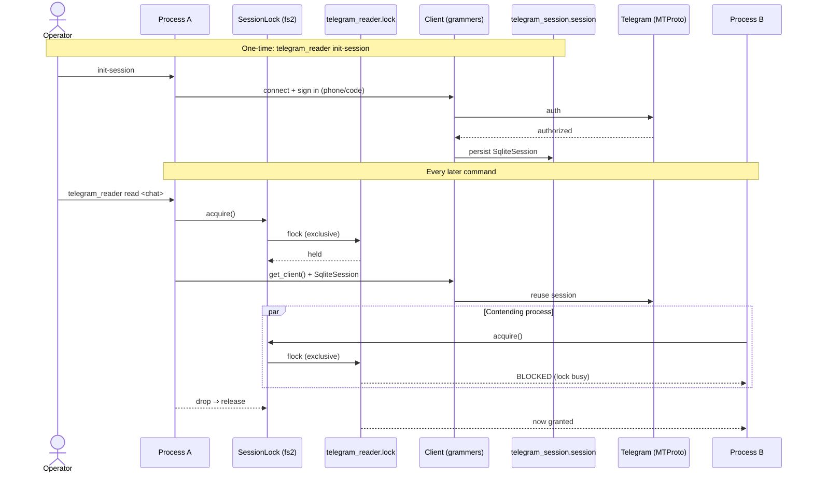

---

## 5. 📤 Flowchart — Chat Export / Read Pipeline

*Purpose:* the `read` / `export` command end-to-end, including hygiene deletions.
Mirrors `src/commands/read.rs` + `src/export.rs`. *Placement:*
`docs/commands/read-export.md`.

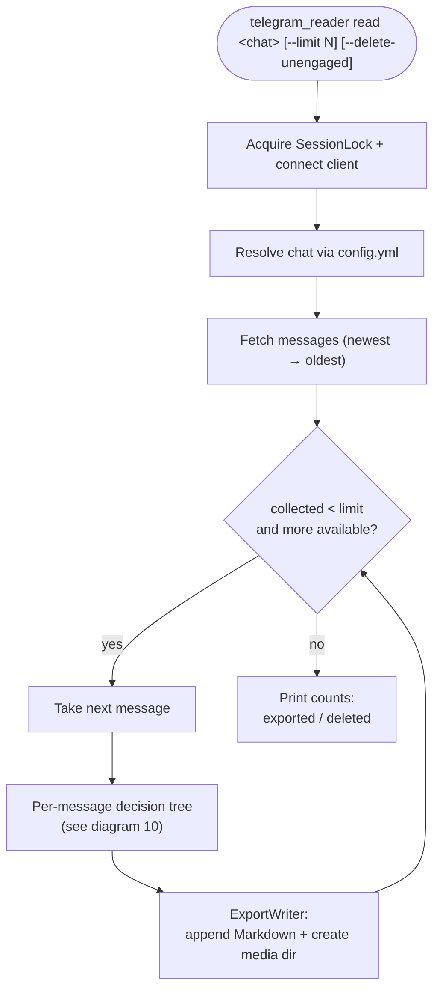

---

## 6. 🤖 Sequence — Auto-Responder / AI Reply

*Purpose:* the `auto-answer` flow — detect an incoming message, load a prompt,
call the LLM, reply. Mirrors `src/commands/autoanswer.rs`. *Placement:*
`docs/commands/auto-answer.md`.

```mermaid
sequenceDiagram
    autonumber
    participant Loop as auto-answer loop
    participant C as Client (grammers)
    participant TG as Telegram
    participant PR as prompts/*.md
    participant AI as OpenAI (OPENAI_MODEL)

    Loop->>C: iter_dialogs / iter_messages
    C->>TG: poll updates
    TG-->>C: new inbound user message
    alt message addressed to us
        Loop->>PR: load system prompt
        PR-->>Loop: system text
        Loop->>AI: chat completion (system + user)
        AI-->>Loop: assistant reply
        Loop->>C: msg.reply(reply)
        C->>TG: send
    else ignore
        Loop-->>Loop: skip
    end
```

---

## 7. 💬 Component — Bot Architecture

*Purpose:* how a teloxide bot wires the Bot API, the shared library, MySQL
persistence, and A/B prompt experiments. Mirrors `src/bin/bots/sales_bot.rs`.
*Placement:* `docs/bots/architecture.md`.

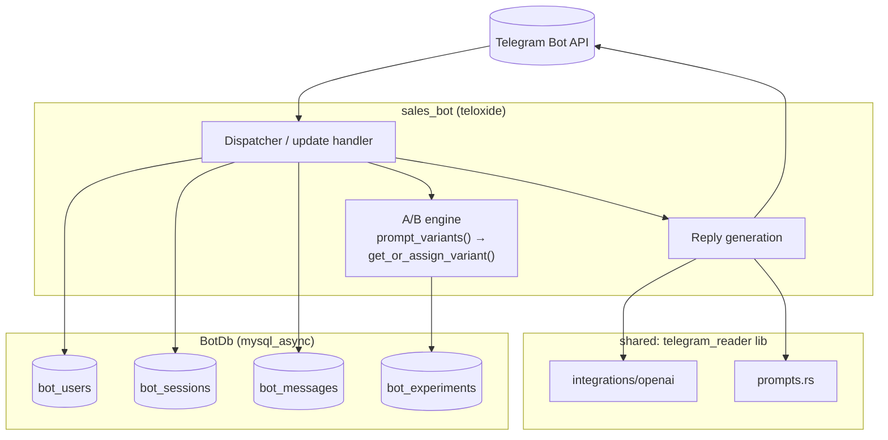

---

## 8. 🔎 Flowchart — LightRAG Indexing & Retrieval

*Purpose:* turning chat history into a hybrid (vector + graph) knowledge base and
answering against it. Mirrors `src/lightrag/*` + `src/analysis/*`. *Placement:*
`docs/lightrag/pipeline.md`.

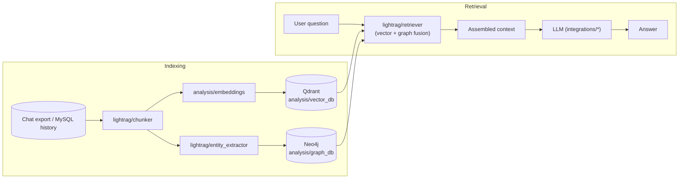

---

## 9. 🧭 Flowchart — SPIDER-SOLO Development Protocol

*Purpose:* the single-agent methodology used in `codev/` — each feature flows
through phases and produces exactly three linked documents (spec, plan, review).
Mirrors `codev/protocols/spider-solo/protocol.md`. *Placement:*
`docs/process/spider-solo.md`.

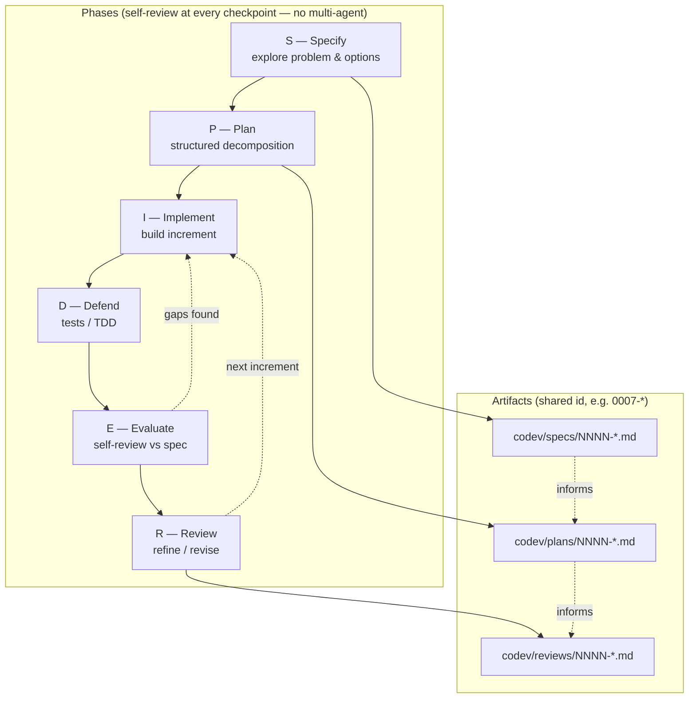

---

## 10. 🌳 Flowchart — Message Processing Decision Tree

*Purpose:* the per-message rules applied during read/moderation — hygiene
deletions, engagement filtering, media download. Mirrors `read.rs` +
the "download media for popular posts" feature. *Placement:*
`docs/commands/message-rules.md`.

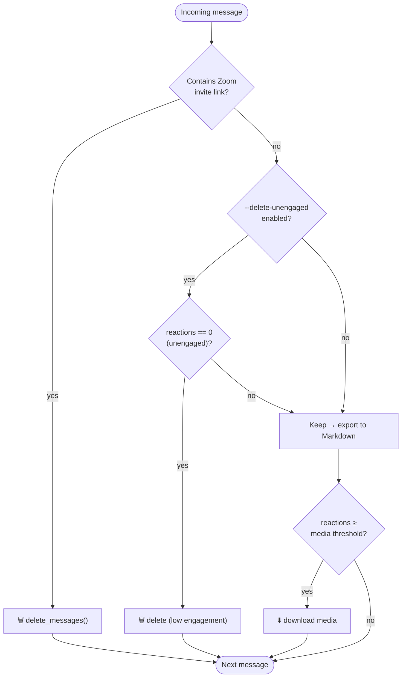

---

## 11. 🗄️ ER Diagram — MySQL Bot / Analytics Schema

*Purpose:* the relational model behind teloxide bots and A/B experiments.
Columns are exact (`src/bin/bots/sales_bot.rs`). Relationships are
application-enforced via indexed keys (not hard FOREIGN KEYs). *Placement:*
`docs/data/schema.md`.

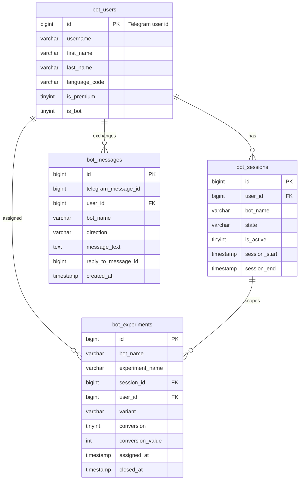

---

## 12. 🧱 Architecture Layers / Module Dependency

*Purpose:* the dependency direction — higher layers depend only downward.
Useful for reasoning about change blast-radius. *Placement:* `docs/architecture.md`.

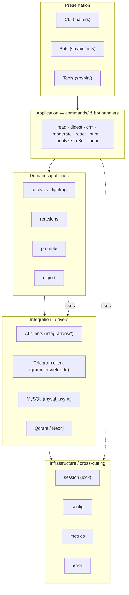

---

## 📎 Usage Instructions

**Embedding.** GitHub renders ```` ```mermaid ```` blocks natively — no build
step. Link the diagrams from `README.md` and per-subsystem docs; each section
above lists a suggested *Placement* file if you want to split this textbook into
focused pages.

**Editing.** Paste any block into the [Mermaid Live Editor](https://mermaid.live)
to tweak and re-export. Keep node IDs short and put prose in quoted labels.

**Exporting static images (for slides / PDF / printed textbook):**
```bash
npx -y @mermaid-js/mermaid-cli -i docs/architecture.md -o build/architecture.md
# or per-diagram:  mmdc -i diagram.mmd -o diagram.svg -t neutral
```

**MkDocs.** Add the Material theme + `mkdocs-mermaid2-plugin`, then drop these
files under `docs/`:
```yaml
# mkdocs.yml
theme: { name: material }
markdown_extensions:
  - pymdownx.superfences:
      custom_fences:
        - { name: mermaid, class: mermaid, format: !!python/name:pymdownx.superfences.fence_code_format }
```

**Typst / PDF textbook.** Render each diagram to SVG with `mmdc` and `#image()`
them into a Typst document; pair each figure with the *Purpose* line as a caption.

**Suggested screenshots to add later:** a real `read` run console, a Grafana
panel fed by `metrics.rs`, and a Qdrant/Neo4j browser view of an indexed chat.

---

## 🎁 Bonus — PlantUML for the deployment view

Mermaid C4 covers context/containers well; for a richer **deployment** view
(nodes, artifacts, ports) PlantUML's C4 library is stronger. Drop this in a
`.puml` and render with the PlantUML server or CLI:

```plantuml
@startuml deployment
!include https://raw.githubusercontent.com/plantuml-stdlib/C4-PlantUML/master/C4_Deployment.puml

Deployment_Node(host, "Linux host", "systemd") {
  Deployment_Node(rt, "Rust runtime", "Tokio") {
    Container(cli, "telegram_reader CLI", "Rust")
    Container(bots, "Bots", "teloxide")
    Container(mon, "n8n_monitor / n8n_backup", "Rust · systemd unit")
  }
  ContainerDb(sqlite, "telegram_session.session", "SQLite")
}
Deployment_Node(data, "Data services") {
  ContainerDb(mysql, "MySQL", "bot_* tables")
  ContainerDb(qdrant, "Qdrant", "vectors")
  ContainerDb(neo4j, "Neo4j", "graph")
}
Deployment_Node(cloud, "External") {
  System_Ext(tg, "Telegram", "MTProto/Bot API")
  System_Ext(ai, "AI Providers", "OpenAI/…")
}

Rel(cli, sqlite, "file-locked session")
Rel(bots, mysql, "mysql_async")
Rel(cli, qdrant, "vectors")
Rel(cli, neo4j, "entities")
Rel(cli, tg, "grammers")
Rel(bots, tg, "teloxide")
Rel(cli, ai, "HTTPS")
@enduml
```
